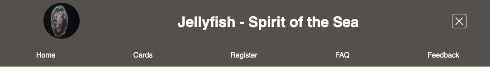

# Jellyfish - Spirit of the Sea

This is a single page application about jellyfish built with React.js. The website contains five pages including home, cards, register, FAQ, and feedback.

---

## How To Use

Inside the directory, the same level as this README file is located. Run the following commands from the terminal:

`npm install` (once per project)
`npm run build`
`npx -s serve build`

---

## Key Features

### 1. Drop down hamburger menu

### 2. Responsive info cards

### 3. Form with validation

### 4. FAQ section with accordions

### 5. Modal form

